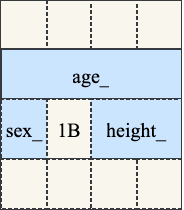
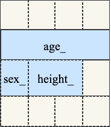

# 1 字节序

## 1.1 存储方式

大端`Big Endian`和小端`Little Endian`是多字节数据在内存中存储字节序的方式。

最高有效字节`MSB (Most Significant Byte)`和最低有效字节`LSB (Least Significant Byte)`存储方式的不同就表现了大小端方式。

1. 大端字节序就是按照人的书写习惯，将高位字节先存，也就是将高位字节存储在低地址位。例如：

一个`uint32_t num = 0x12345678`，它存储在内存从低地址到高地址是`0x12345678`。

2. 而小端字节序相反，将高位字节存储在高地址位。同样的`uint32_t num = 0x12345678`，它按照小端方式存储就是`0x78563412`。
3. 由于历史原因，数据在`TCP/IP`中传输采用的是大端字节序，因此大端也叫做网络字节序。而在主机中数据保存的字节序被称作主机字节序，它依赖于平台，有可能是大端也有可能是小端。

## 1.2 检验方法

可以通过指针从低地址到高地址访问一个数据看到它的字节序：

```cpp
    uint32_t number = 0x12345678;
    uint8_t* ptr = reinterpret_cast<uint8_t*>(&number);

    for (int i = 0; i < sizeof(uint32_t); ++i) {
        std::cout << std::hex << static_cast<uint32_t>(ptr[i]) << ' ';
    }
    std::cout << '\n';
```

​    它打印出的结果是`78 56 32 12`，因此是小端字节序。

## 1.3 网络通信

服务端和客户端网络通信时，双方都需要将端口号和`IP`从主机字节序转化为网络字节序，以保证连接时的一致。

在服务端中：

```cpp
// Server
struct sockaddr_in addr;
addr.sin_family = AF_INET;
addr.sin_port = htons(port_);
addr.sin_addr.s_addr = INADDR_ANY;
ret = bind(lfd_, (struct sockaddr*)&addr, sizeof(addr));
```

这里`INADDR_ANY`就是`0.0.0.0`表示监听所有网卡，它无所谓字节序。

在客户端中：

```cpp
struct sockaddr_in addr;
addr.sin_family = AF_INET;
addr.sin_port = htons(9999);
// 127.0.0.1: 0x7f000001 -> big endian: 0x7f000001
inet_pton(AF_INET, "127.0.0.1", &addr.sin_addr.s_addr);
```

`inet_pton`可以将字符串格式的`IP`转化为网络字节序。

同时如果发送网络数据，例如发送一个数据包并在数据包头部加入4个字节的整形来表述数据包的长度，那么这个数据包长度也要转化为网络字节序，而对端接收到这个数据包的大小，那么需要从网络字节序转化为主机字节序。例如：

```cpp
// buf是加入了数据长度作为头部的Protobuf数据包
std::string data = buf->data(sizeof(int));
int length = *reinterpret_cast<int*>(data.data());
length = ntohl(length);
data = buf->data(length);
```

# 2 内存对齐

内存对齐是为了CPU更快的读取数据，它针对的是类，结构体或联合体。

## 2.1 规则

内存对齐的两条规则是：

1. 数据的起始地址必须是是其自身大小的整数倍。
2. 对象的对齐值是其成员中占用内存最大的数据类型的大小。

例如：

```cpp
class Child {
  private:
    int age_;
    char sex_;
    short height_;
};
```

这个类的对象的大小是8个字节。

需要注意对于由虚函数的类，每个对象中有一个指向这个类的虚函数表`vtable`的虚表指针`vptr`，而增加一个虚函数只会向`vtable`新加入一个函数指针，但`vptr`的大小不变，因此类对象的内存大小也不变。

## 2.2 #pragma pack

对于有数据紧凑存放的要求的，例如`TCP`的数据报文头部需要将每个字段紧凑分布的。

那么可以使用`#pragma pack(1)`来设置对齐大小为1，这样就不会有填充空间。

```cpp
#include <iostream>

#pragma pack(1)
class Child {
  private:
    int age_;
    char sex_;
    short height_;
};
#pragma pack()

int main() {
    // 7 Bytes
    std::cout << sizeof(Child) << '\n';

    return 0;
}
```

## 2.3 存放技巧

因为对象大小是成员大小+填充字节，小类型在前会导致填充，例如上述例子中`char`要比`short`类型要小，造成了因为内存对齐产生了1字节的填充，因此定义类的时候将大类型放在前面，小类型放在后面。

```cpp
// 12 Bytes
class Child {
  private:
    char sex_;
    int age_;
    short height_;
};
```
