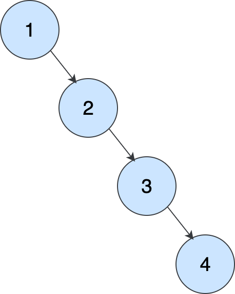
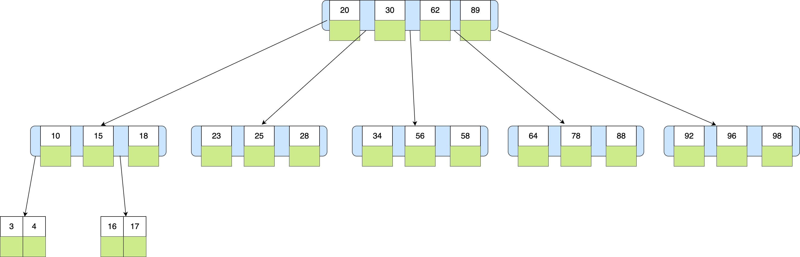
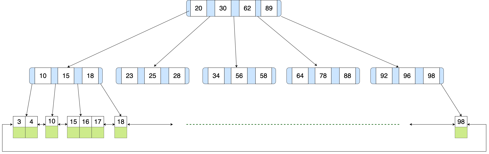

索引可以帮助存储引擎加快定位数据行，而不是全表扫描，`SQL`层中的优化器会判断是否选择索引。

# 1. 索引结构

索引的结构是指索引的逻辑结构，同时也是存储引擎存储数据在磁盘或内存的形式。

## 1.1 B+树索引

B+树是`InnoDB`的默认索引结构。它是B树`B-Tree`的变种，B树就是多路平衡搜索树。B树是红黑树的一个变种，红黑树就是平衡二叉搜索树，它是`BST (Binary Search Tree)`的变种。

1. 对于`BST`，在顺序插入的时候会形成一个链表，层级很深，难以查询。

2. 红黑树尽管是平衡的，但是也会在数据量过大的时候出现层级过深，因为它还是二叉树。

3. B树的阶数就是节点的最大度数，例如5阶的`B-Tree`每个节点最多存储4个`key`，5个指针，每一个树节点对应了一个磁盘或内存页4KB，`key`是升序排列，可以通过二分查找找到最大的`key <= target`。

但是B树的范围查询每次都要回到父节点导致效率低，同时每个块都要保存数据导致每一个树节点存储的键值对减少，从而只能增加树的深度，导致查询变慢。

4. B+树将数据保存在叶子节点，非叶子节点只保存索引，同时将叶子节点变成一个双向链表，范围查询直接沿着链表查询更加高效。查询的时间复杂度为$O(log(n))$。



## 1.2 哈希索引

通过`hash table`来实现精确查询，时间复杂度为$O(1)$，但不支持范围查询，同时无法排序。

## 1.3 位图索引

每个枚举值用一个二进制数来表示，例如：

| name | sex   |
| :--: | :----: |
|  A   | female |
|  B   | male |
|  C   | female |
|  D   | male |

对应的位图是`female_bitmap: 1 0 1 0, male_bitmap: 0 1 0 1`，如果要查询`WHERE sex = 'female'`，那么`female_bitmap & 1`

得到`0, 3`行，再比如如果要查询`WHERE sex IN ('female', 'male')`，就`female_bitmap | male_bitmap`。

位图索引对于枚举值很少的情况和多条件查询十分高效。

# 2. 索引规则

## 2.1 建立索引

1. 业务约束的主键索引，唯一索引。

2. 尽量在`WHERE, JOIN, ORDER_BY, GROUP_BY`的列中加索引。

3. 建立联合索引将使用`WHERE`的频率高的字段放在左边，区分度高的字段放在左边。

    `区分度 = 唯一值数量 / 总记录`，区分度高每个索引能过滤掉更多行，查询效率更高。可以使用`SELECT COUNT(DISTINCT col) / COUNT(primary_key) FROM table;`查询区分度。

4. 即使有了联合索引还是可以建立单列索引，因为单列索引占用的空间更小，B+树更更矮，查询的效率会更高。
5. 建立覆盖索引来避免回表，但同时要注意单页占用空间过大，导致查询反而更慢。


## 2.2 索引操作

1. 创建索引有三种方式，建表时，`ALTER TABLE`，`CREATE INDEX`。

```sql
CREATE TABLE users (
    id BIGINT PRIMARY KEY AUTO_INCREMENT,
    user_name VARCHAR(100) NOT NULL UNIQUE,
    email VARCHAR(100),
    created_time DATETIME,
    age INT,

    UNIQUE idx_emil (email),
    INDEX idx_created_time (created_time)
);

ALTER TABLE users ADD INDEX idx_name_email (user_name, email);

CREATE INDEX idx_age ON users(age);
```

2. 删除索引`DROP INDEX idx_age ON users;`
2. 显示所有索引`SHOW INDEX FROM users;`

## 2.3 索引失效

1. 一般的函数或运算会让索引失效，例如`WHERE DATE(date) = '2025-01-01'`，`WHERE sum + 1 = 10`，`WHERE LEFT(name, 3) = 'abc'`, `WHERE age != 30`。但`name LIKE 'abc%'`这种不会，因为它可以被`InnoDB`优化成`name >= 'abc' AND name < 'abd'`， 但 `LIKE %abc`前模糊匹配会让索引失效。

2. 使用联合索引要满足最左前缀法则，从左到右必须连续匹配。例如对于一个联合索引`(a, b, c)`，`WHERE a = 1`会走索引，`WHERE a = 1 AND c = 1`也会走索引，但是只用到`a`索引。`WHERE b = 1`也不会走索引。特别的`WHERE c = 1 AND a = 1 AND b = 1`这种等值条件也会走索引，优化器会自动调整位最左前缀。

    范围查询会阻断右侧查询，例如`WHERE a > 1 AND b = 3 AND c = 2`，实际索引只使用了`a`的索引。

3. `WHERE name = 'xxx' OR age = 30`，其中`age`没有索引，导致`OR`整个查询索引失效。

## 2.4 抢红包系统

一个抢红包系统为例，要设计四张表`users, red_envelops, packet, envelops_record`，其中的索引包括：

1. 用户表

    `id`主键索引，它是唯一标识用户与各个之间的关联，在查询用户时必然要用到。

    `username`唯一索引，用户名唯一的约束，在登录时使用`WHERE usrname = 'xx'`，加快查找速度。

2. 大红包
    `id`主键索引，在查询红包时一定会用到。

    `sender_id`普通索引，查询一个用户发过哪些红包`WHERE sender_id = 'xxx'`。

    `created_time`普通索引，红包和时间相关的可能会用到，例如按照最新发的红包排序`ORDER BY created_time DESC LIMIT N`，查找最近10分钟的红包`WHERE created_time >= NOW() - INTERVAL 10 MINUTE`。

3. 红包中的小份

    `id`主键索引，唯一标识红包小份。

    `envelop_id`普通索引，查询一个红包所有的小份`WHERE envelop_id = 'xxx'`。

    `grabbed_by`普通索引，查询某个用户抢了多少红包`WHERE grabbed_by = 'xxx'`。

4. 抢红包记录

    `id`主键索引，查询每一次抢红包的记录。

    `(envelop_id, user_id)`唯一联合索引，确保每个人抢红包只能抢一次。

    `envelop_id`普通索引，查询某个红包的抢红包记录`WHERE envelop_id = 'xxx'`。

    `user_id`普通索引，查询某个用户的抢红包记录`WHERE user_id = 'xxx'`。

## 2.5 索引分析

分析主要由两部分，一部分是执行计划分析，另一部分是实际执行时间分析。

执行计划分析使用`EXPLAIN`，例如`EXPLAIN SELECT age FROM users WHERE name = 'xxx';`结果的主要指标包括：

1. `type`表示扫描方式，`ALL`是全表扫描，`ref/range/const`表示使用了索引。
2. `possible_keys`是可能用到的索引。
3. `key`实际使用的索引。
4. `Extra`如果是`Using index`表示有覆盖索引，`Using where`表示在索引过滤后，还要再通过`WHERE`中的条件过滤。

实际执行时间可以使用`SHOW PROFILES`来查询`SQL`的执行时间。

