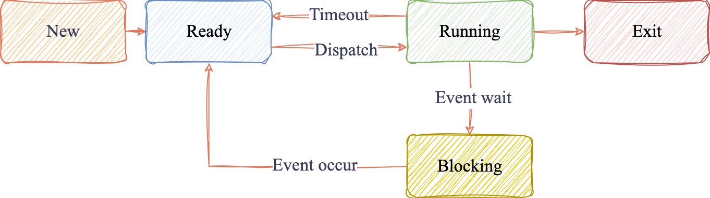

线程是进程中的一个执行单元，在一个进程中的内存空间中，不同线程既有共享资源包括代码段`.text`，全局变量和静态变量`.data, .bss`， 堆区`heap`，同一进程文件中的文件描述符`fdtable`，`mmap`，也有自己独立的资源包括栈区`stack`，寄存器状态。

### 1. PCB和TCB

从操作系统的层面说，线程控制模块`TCB (Thread Control Block)`中就存储了线程独占的字段，包括寄存器的上下文，`stack`的起始地址以及大小，以及线程ID`tid`，此外还存储了一些元数据包括线程状态，调度信息（调度策略，时间片，优先级），同步信息（被阻塞而等待的锁，条件变量，信号量），指向所属进程控制模块`PCB (Process Control Block)`的指针。

而`PCB`保存着： `PID`，父进程ID，用户ID。进程状态， `PC`，进程切换时的寄存器上下文。进程的页表，段表，`fdtable`，进程的调度时间片，进程优先级，还有进程的信号处理表，以及进程的多线程列表等。每个进程都有自己的`PCB`，当进程终止的时候操作系统释放`PCB`。一个`PCB`包含多个`TCB`。

线程是CPU调度的最小单位，CPU的调度和上下文切换都是围绕`TCB`执行的。而操作系统内存分配的最小单位是进程，它是围绕`PCB`进行的。

### 2. 线程和进程状态

线程状态和进程状态从CPU层面看都是四种基本状态：1. 就绪`Ready`：表示已经分配好资源等待CPU调度。2. 运行`Running`：占用CPU执行指令中。3. 阻塞`Blocked`：正在等待I/O，信号，互斥锁等事件。4. 终止`Exit`：已执行完毕或被强制终止，正在清理资源。此外还有新建状态`New`，表示CPU正在创建线程或进程，因为新建态很快就进入就绪态所以一般不算作基本状态。

状态转移：

实际上在操作系统中会将四种基本状态再细分：

1. `R (Ready, Running)`：运行或就绪。

2. `S (Sleeping)`：可中断睡眠。等待事件时可以被信号中断，例如`select, epoll_wait, read`等待读写缓冲区，或者阻塞在条件变量上时都可以被信号中断。

3. `D (Uninterruptible Sleep)`：不可中断睡眠。阻塞在某个内核操作，例如等待磁盘`IO`，不能被信号中断。

4. `I (Idle kernel thread)`：内核态的空闲线程。

5. `Z (Zombie)`：僵尸进程。子进程已经调用`exit`退出，之前父进程还没有调用`wait()`等待子进程结束并获取到它的退出状态，因此子进程没有被回收，它的`PCB`还保留在内核中，等待父进程回收。僵尸进程本身不占用CPU，只会占用内核资源。

    往往父进程不会等待子进程的结束，因此一般处理方法是使用`signal(SIGCHLD, SIG_IGN);`来忽略子进程退出的信号，让内核来回收子进程的资源。

6. `T (Stopped)`：被信号终止。例如`SIGSTOP`。

因为`pthread_create`默认创建的是`joinable`线程，在线程退出后，如果主线程没有`pthread_join`那么`TCB`还是会在用户态的`pthread`中，不会涉及到内核态，因此没有`Z`状态。

如果父进程在`fork`出一个子进程后，先`exit`，那么这个子进程就成了一个孤儿线程`Orphan Process`，`init`线程会接管它成为新父进程。此时这个进程就运行在后台，对于系统服务它也叫做守护进程`Daemon Process`，此时可以使用信号`SIGTERM`，也就是`kill <pid>`杀死这个进程。

### 3. 通信

线程间的通信是通过临界变量实现的，因为多个线程有共享的内存空间，如堆，全局变量和静态变量，但需要通过线程同步来保证线程安全，例如互斥锁`pthread_mutex_t, std::mutex`，读写锁`pthread_rwlock_t, std::shared_mutex`，原子变量`std::atomic`保证基本数据类型的线程安全，条件变量`pthread_cond_t, std::condition_variable`。同时它也可以通过`socketpair`创建一对文件描述符`fd`用来读写数据进行线程间的通信。

而进程之间的通信`IPC (Inter Process Communication)`要复杂一些，包括共享内存`shm (shared memory)`，`mmap`，管道`pipe`，消息队列`MQ (Message Queue)`，信号`signal`，`socket`。

共享内存的速度是最快的，多进程直接访问一片内存空间，不涉及用户态与内核态之间的拷贝，但它存在进程安全，因此需要使用信号量`Semaphore`来保证，同时它需要手动释放。

管道是基于字节流的，它是自动同步，无法随机访问，效率不高。

### 4. 死锁

死锁就是多个线程/进程互相等待对方持有的资源而陷入永久阻塞，程序无法继续执行的情况。

死锁的四个必要条件是：

1. 互斥条件：某个时刻这个资源只能被一个线程/进程占用，例如`std::mutex`。
2. 占有等待条件：一个线程/进程已经占用了至少一个资源并且不释放，但是又在等待获取其他资源。
3. 不剥夺条件：线程/进程占用的资源无法被强制剥夺。
4. 循环等待条件：A线程等待B线程解锁，B线程等待A线程解锁，形成一个闭环。

解决死锁就是针对这四个必要条件的：

1.  所有线程统一顺序加锁，就不会形成闭环。打破了循环等待条件。
2. 使用`try_lock_for,try_lock_until`。如果无法获得锁，就在某个时间返回，不再等待。破坏了占用等待条件。
3. 使用`std::lock_guard, std::unique_guard`这些`RAII`机制避免某些锁未释放导致的占用等待。

### 5. 崩溃

多进程程序中一个进程崩溃的不会影响其他进程，而一个线程崩溃就会让整个进程被终止，例如一个线程中出现访问非法内存，操作系统就会发送`SIGSEGV`信号给整个进程，导致进程被终止。因为每个进程的内存空间，`fdtable`等资源是独立的，而多个线程会共享进程的一部分内存空间。可以在线程中捕获异常来防止进程崩溃。

相对于进程，线程是轻量级进程`LP (Lightweight Process)`，它的上下文切换只需要切换栈信息和寄存器信息，而进程还需要切换页表，段表，`fdtable`等等，开销更大，它的创建速度也更慢。

在处理并发任务时往往使用多线程，对于CPU计算密集型任务，线程数设置为CPU核心数，是为了让每个线程各占用一个核心，尽量避免线程上下文切换的开销，实现并行计算。对于IO读写密集型任务，线程数要大于CPU核数，因为当一个线程阻塞等待IO时，其他线程可以占用CPU，提高CPU利用率。
